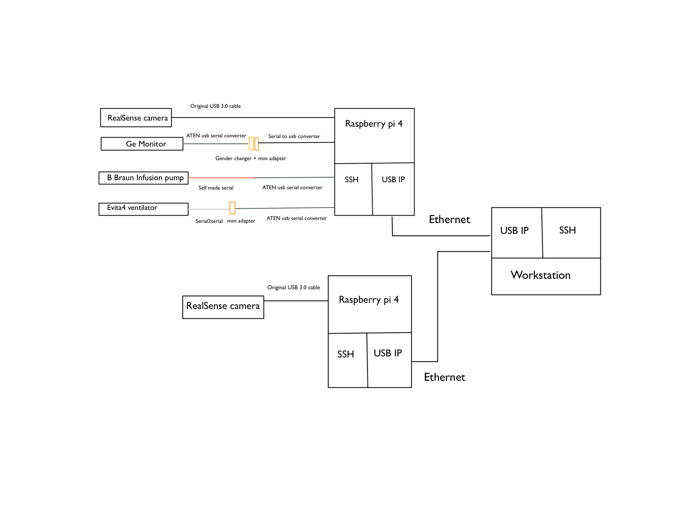
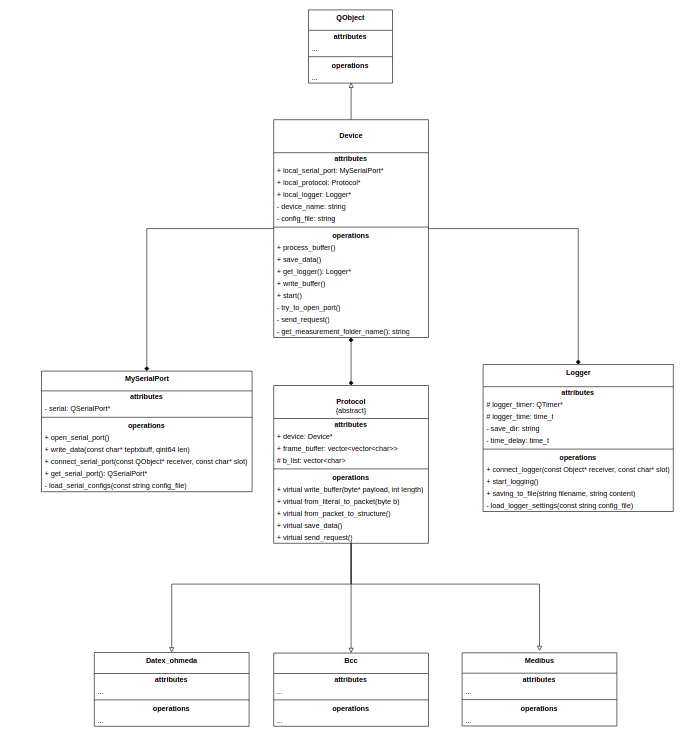

# icu_devices
This is an implementation for data retrieving from ICU devices and realsense camera.

```
Icu_devices_project
│   README.md
│   LICENSE    
│
└───document : 
|   |   imgs
|   |   docu [contains official documents for devices]
|   |   hardware_list.md
|   |   ...
|
└───code : [Code for data retrieving]
│   │   bbraun_const.h
│   │   bbraun.cpp
│   │   ...
│   
└───scripts : [Scripts for connecting and disconnecting hardwares]
|   │   cancel_local.sh
|   │   cancel_remote.sh
|   │   start_local.sh
|   │   start_remote.sh
|
└───data : [Data retrieved from devices]
    │   XXXX.csv
    │   ...

```
The connection is shown in the following graph, more detailed description about connections can be found in the file *hardware_list.md*

<br>

## Folder **scripts**
Inside this folder you will see 4 bash scripts. They are used to automatically connect hardwares (ICU devices and cameras) to station via usbip service.

### Connect everything
* To connect everything, just run *"sudo sh start_local.sh"*, it will perform the following tasks

> **STEP 1 : Copy and run commands in Raspberry pi**: Copy start_remote.sh file to two raspberry pi and run the file there. It will mount necessary driver, start usbip service and bind all devices to the usbip service.\
> **STEP 2 : Mounting necessary driver for usb-ip** \
> **STEP 3 : Connecting existing devices from ip address** : List all devices bind to the two raspberry pi and filter out the bus-id of devices, attach the devices with their bus-ids\
> **STEP 4 : Changing access permission of USB devices**: Giving software the access permission to serial ports


### Disconnect everything
* To disconnect everything, just run *"sudo sh cancel_local.sh"*, it will perform the following tasks

> **STEP1 :  Stop usbip locally**\
> **STEP2 :  Copy and run commands in Raspberry pi** : Copy cancel_remote.sh file to two raspberry pi and run the file there. It will unbind devices and kill the usbip service.

\
<br>


## Folder **code**
In this folder you will see the Qt project to retrieve data from medical devices. 
\
\

\
\
In general, since all medical devices use serial protocal to do the communication, they all inherited from the Device class who contains a Qtserial port for serial communicating. Since they have similar workflow, the common functions can be refactored into father class in the future.

```
GE_Monitor
│   ge_monitor.cpp
│   ge_monitor.hpp
│   datex.h    

BBraun
│   bbraun.cpp
│   bbraun.hpp
│   bbraun_const.h

Evita4_vent
│   evita4_vent.cpp
│   evita4_vent.hpp
│   draeger.h  

```

There is a function called start() in all ICU_devices, which is the main loop of program flow, you can change the request and period. More detailed descriptions are found in documents folder.