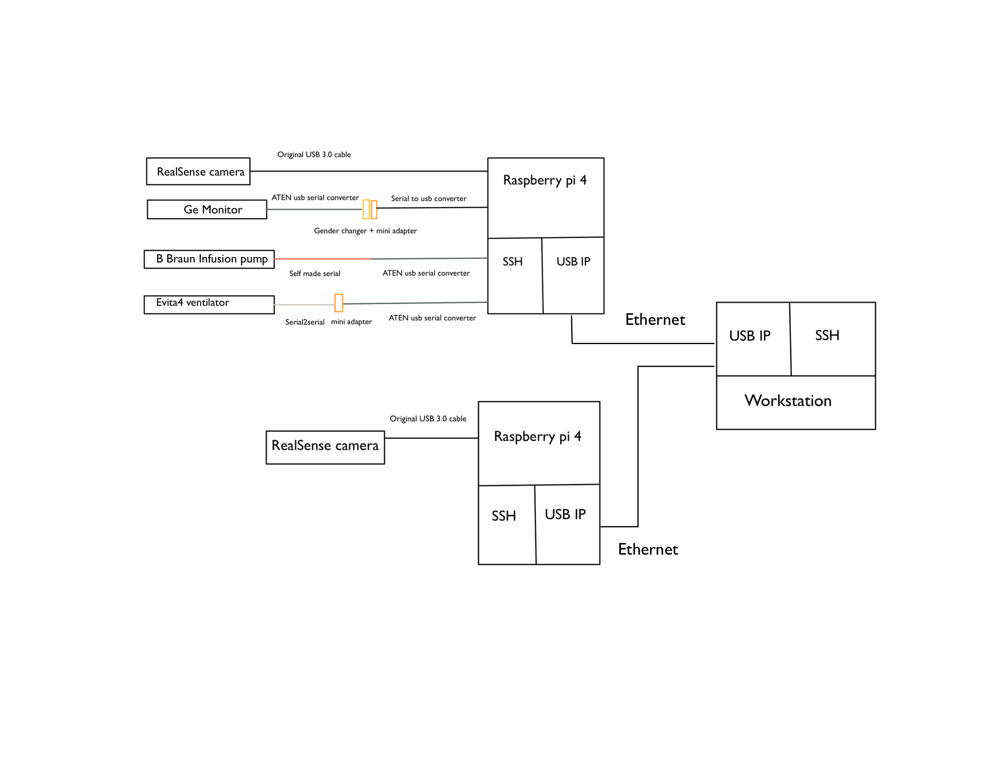
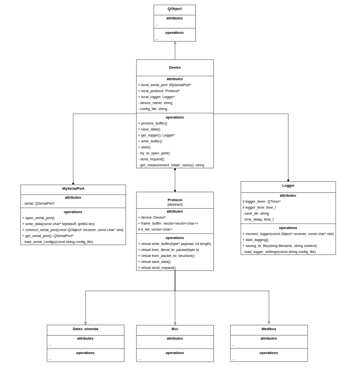
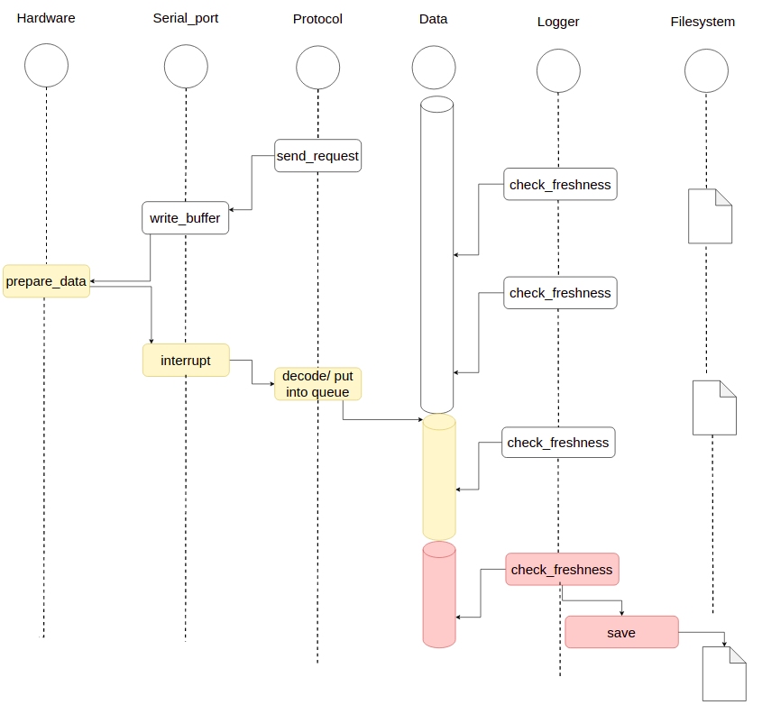

# icu_devices
This project contains code and scripts for data retrieving from ICU devices (GE_Monitor, Braun perfusor and Evita 4 ventilator) and realsense camera.

```
icu_devices_project
|   README.md
|   LICENSE    
|   ...
|
|---docs : 
|   |   imgs
|   |   manufacturers [contains official documents for devices]
|   |   hardware_list.md
|   |   ...
|
|---raspberrypi :
|   |   README.md
|   |   raspberrypi.pro [qt file]
|   |   build_project [script to compile the project]
|   |
|   |---src : [Code for data retrieving]
|   │   |   bbraun_const.h
|   |   |   bcc.cpp
|   │   |   ...
|   │   
|   |---cfg : [Config files to save data, will be copied to build folder by the script]
|   |   |   general_config.txt
|   |   |   ...
|   |
|   |---data : [Data retrieved from devices]
|   |   |   XXXX.csv
|   |   |   ...
|
|---scripts : [Scripts for connecting and disconnecting hardwares]
|   |   cancel_local.sh
|   |   cancel_remote.sh
|   |   start_local.sh
|   |   start_remote.sh
|
|───arduino: [code for urine scale]

```
The whole hardware connection setup is shown in the following graph, more detailed description about connections can be found in the file *hardware_list.md*

<br>

## Folder **scripts**
Inside this folder you will see 4 bash scripts. They are used to automatically connect hardwares (ICU devices and cameras) to station via usbip service. More detail is found in the Readme.md file.
\
<br>


## Folder **src**
In this folder you will see the Qt project to retrieve data from medical devices. 
\
\

\
\
All medical devices would be an object of class Device. It mainly consists of three parts.
1. **Serial port object**, to deal with UART comunication related tasks. For example, serial port setting, writing to serial port, and getting data from UART buffer with Interrupt.
2. **Logger**, to deal with filesystem related tasks. For example, periodically checking the freshness of data, saving data into filesystems
3. **Protocol**, each different types of device has its own protocol. It deals with request preparing and data decoding related tasks. The mapping between devices and protocols is as follows:

```
GE_Monitor <-> Datex_ohmeda

BBraun <-> Bcc

Evita4_vent <-> Medibus
```


## Workflow of program
\
\



In the begining, the protocol will prepare the request according to configure file and send it with serial port object. 

After getting the request, the hardware prepare the data and send it back.

The UART receive buffer will generate an interrupt after getting data, this will invoke decoding related code in Protocol. The decoded code will be put into an data array with the timestamp.

The logger will periodically check the data in the data array, if the timestamp of the data is "old enough". It will save the data into filesystem and remove the data from the array.
