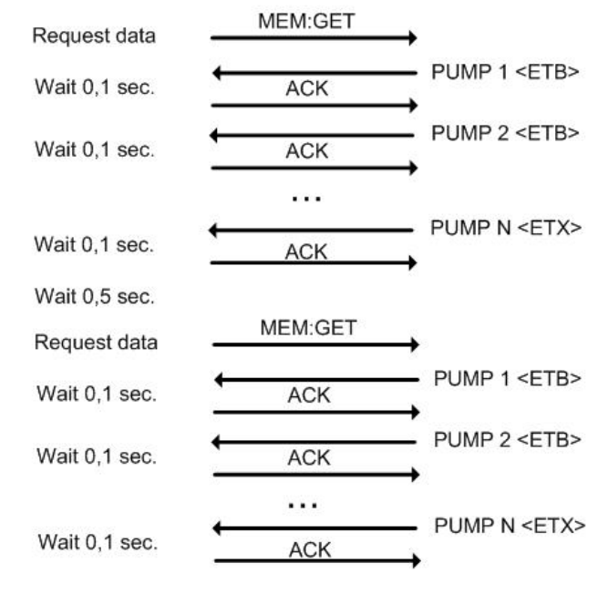

## BBraun Perfusor

This implementation is based on Technical Interface Specification BCC. This communication protocol is used between a ComDevice and a BCC client.

### Communication Protocol

This BCC communication protocol sends polling request to the perfusor. The request need to be sent periodically to get new data. The workflow is shown in the following graph:

The data might need to be transferred separately into separated packets, the PC will reply *ACK* message to each reveived packet.

* We can get the following types of data from the device:
1. SpaceCom Framework related information (address of  the device)
2. Perfusion related data (rate, time, medical name ...)
3. Alarm information (1 or 0)

* This communication protocol does not make a difference to different types of data. so the workflow is easy, the **GET_MEM** request will be sent to the device periodically with the help of *Qtimer*.

 

    connect(timer_cp1, SIGNAL(timeout()), this, SLOT(send_get_mem_request()));

    void Bbraun::start(){
        try {
            std::cout<<"Try to open the serial port for Bbraun perfusor"<<std::endl;
            try_to_open_port();

            std::cout<<"Initialize the connection with "<<std::endl;
            request_initialize_connection();

            timer_cp1->start(3000);

        }  catch (const std::exception& e) {
            qDebug()<<"Error opening/writing to serial port "<<e.what();
        }
    }