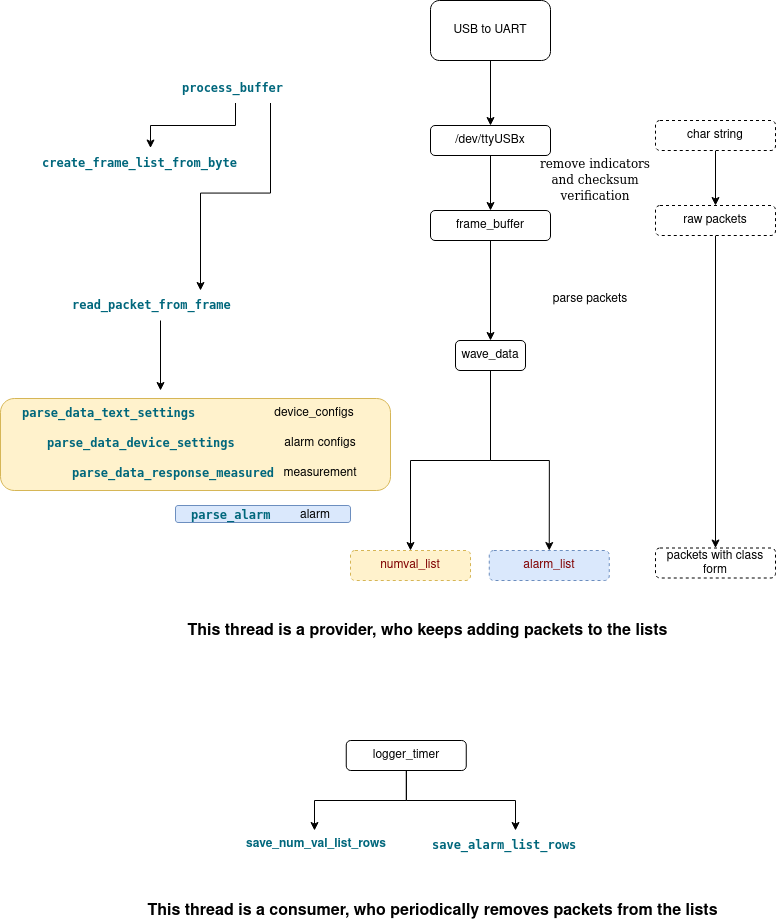

# Evita4 ventilator

This implementation is based on MEDIBUS protocol.

MEDIBUS is a software protocol intended to be used by
two medical devices for exchanging data and control
functions via their RS 232 interfaces.

## communication protocol

There are mainly 2 different kinds of communication manner in this protocal.

### Type 1 request (static data)

To get the following data
* alarms
* alarm low/high limits
* measurement data (static)
* text messages
* device settings

We need to send the request periodically for the newest update. It important to know, the device will only reply the request one by one, requests that are sent simutaneously will be ignored. Like in the following start() example, we can bind timer with requests.
* One important thing:
    According to the medibus protocol, the request can only be answered one by one. If multiple requests arrive at the same time, or if the requests come before the last request is answered, the request will be dropped. If the request drop happens, we cannot guarantee the time interval between received data is constant. A smarter schedule strategy for sending requests need to be used here.

 

    void Evita4_vent::start(){
        try {
            std::cout<<"Try to open the serial port for Evita 4"<<std::endl;
            try_to_open_port();

            std::cout<<"Initialize the connection with Evita 4"<<std::endl;
            request_icc();

            timer_cp1->start(5000);
            timer_cp2->start(5000);
            timer_cp3->start(1000);
            timer_cp4->start(1000);
            timer_cp5->start(3000);

        }  catch (const std::exception& e) {
            qDebug()<<"Error opening/writing to serial port "<<e.what();
        }
    }

You can bind the timers with to 
    
    1. request_device_settings()
    2. request_alarmCP1()
    3. request_alarmCP2()
    4. request_text_messages()
    5. request_alarm_low_limit()
    6. request_alarm_high_limit()
    7. request_measurement_cp1()

The response corresponds to 
    
    1. The current values of all device settings applicable with the responding device.
    2. Current measured Data (codepage 1)
    3. Current measured Data (codepage 2)
    4. All the text messages the requested device currently holds for user information, along with the text code, text length and an end-of-text marker.

A more detailed description for measured data is found in page 17 of ducument *intensive_care_devices.pdf*

### Type 2 request (Realtime data)
* This request is used to receive waveform data. This request is not designed to run simutaneously with the type 1 request, since the mixed responses cannot be decoded.

## Request
 

