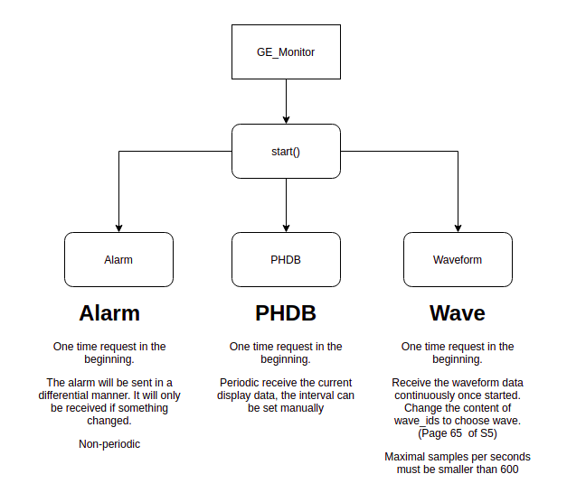

# GE Monitor

Patient data measured by S/5 Network compatible monitors can be accessed by external
applications through S/5 System Interface. The S/5 System Interface consists of a serial RS232
interface (called S/5 Computer Interface) that can be accessed directly by external
applications. Based on the documents for S/5 System Interface, we developed the program.

In general, 4 different kinds of data are available with S/5 System Interface and they are:

    1. Physiological Data ADI (DRI_MT_PHDB)
    2. Alarm Transmission ADI (DRI_MT_ALARM)
    3. Waveform ADI (DRI_MT_WAVE)
    4. Network Management ADI (DRI_MT_NETWORK)

Only the Physiological data and Waveform data are of our concern, so only the interaction with them are implemented. More detail can be found in following documents.

    8005313_10th_S5_DRI_Specification.pdf
    Bx50_Computer Interface Specs.pdf

## Working pattern
 

## Requests
 

### physiological data
 

The code for preparing a physiological data transmission request is as follows. The following example will get all PHDB data every 10 seconds.

    struct datex::datex_record_phdb_req requestPkt;
    struct datex::dri_phdb_req *pRequest;

    //Clear the pkt
    memset(&requestPkt,0x00,sizeof(requestPkt));

    //Fill the header

Here the length of packet is calculated

    requestPkt.hdr.r_len = sizeof(struct datex::datex_hdr)+sizeof(struct datex::dri_phdb_req);

We want to get Physiological data 

    requestPkt.hdr.r_maintype = DRI_MT_PHDB;

TODO:: No idea what should be the correct value, 0 works anyway

    requestPkt.hdr.dri_level =  0;

    //The pkt contains one subrecord
    //0 = Physiological data transmission request
    requestPkt.hdr.sr_desc[0].sr_type = 0;
    requestPkt.hdr.sr_desc[0].sr_offset = (byte)0;
    requestPkt.hdr.sr_desc[1].sr_type = (short) DRI_EOL_SUBR_LIST;

    //Fill the request
    pRequest = (struct datex::dri_phdb_req*)&(requestPkt.phdbr);
    pRequest->phdb_rcrd_type = DRI_PH_DISPL;

Gives the time interval

    pRequest->tx_ival = 10;

Get all 4 types of Physiological data

    pRequest->phdb_class_bf = DRI_PHDBCL_REQ_BASIC_MASK|DRI_PHDBCL_REQ_EXT1_MASK|DRI_PHDBCL_REQ_EXT2_MASK|DRI_PHDBCL_REQ_EXT3_MASK;

The description for the content of these 4 kinds of data is available from page 19-57 (pdf page) in document *8005313_10th_S5_DRI_Specification.pdf*
 
 
 

### alarm data
 

The code for preparing a alarm data transmission request is as follows. 
    struct datex::datex_record_alarm_req requestPkt;
    struct datex::al_tx_cmd *pRequest;

    //Clear the pkt
    memset(&requestPkt,0x00,sizeof(requestPkt));

Here the length of packet is calculated

    //Fill the header
    requestPkt.hdr.r_len = sizeof(struct datex::datex_hdr)+sizeof(struct datex::al_tx_cmd);
    requestPkt.hdr.r_maintype = DRI_MT_ALARM;
    requestPkt.hdr.dri_level =  0;

    //The pkt contains one subrecord
    requestPkt.hdr.sr_desc[0].sr_type = 0;
    requestPkt.hdr.sr_desc[0].sr_offset = (byte)0;
    requestPkt.hdr.sr_desc[1].sr_type = (short) DRI_EOL_SUBR_LIST;

    //Fill the request
    pRequest = (struct datex::al_tx_cmd*)&(requestPkt.alarm_cmd);

Here we choose differential mode, which only transfer data when there is a change in alarm status

    pRequest->cmd = DRI_AL_ENTER_DIFFMODE;

    byte* payload = (byte*)&requestPkt;
    int length = sizeof(requestPkt);
    //return payload
    tx_buffer(payload,length);

The description for the alarm data is available from page 61-63 (pdf page) in document *8005313_10th_S5_DRI_Specification.pdf*
 
 
 

### Waveform

 

The code for preparing a waveform data transmission request is as follows. The following example will start to get ECG1 signal waveform.

    struct datex::datex_record_wave_req requestPkt;
    struct datex::dri_wave_req *pRequest;

    //Clear the pkt
    memset(&requestPkt,0x00,sizeof(requestPkt));

    //Fill the header
    requestPkt.hdr.r_len = sizeof(struct datex::datex_hdr)+sizeof(struct datex::dri_wave_req);

We want to get waveform data

    requestPkt.hdr.r_maintype = DRI_MT_WAVE;
    requestPkt.hdr.dri_level =  0;

    //The pkt contains one subrecord
    //0 = Waveform data transmission request
    requestPkt.hdr.sr_desc[0].sr_type = 0;
    requestPkt.hdr.sr_desc[0].sr_offset = (byte)0;
    requestPkt.hdr.sr_desc[1].sr_type = (short) DRI_EOL_SUBR_LIST;

    //Fill the request
    pRequest = (struct datex::dri_wave_req*)&(requestPkt.wfreq);

In the stop waveform request, this need to changed to **WF_REQ_CONT_STOP**

    pRequest->req_type = WF_REQ_CONT_START;

Here you need to fill which waveform you want to get, the code number for each type of waveform is found in page 69 (pdf page) of document *8005313_10th_S5_DRI_Specification.pdf* . The last one need to be **DRI_EOL_SUBR_LIST**

    pRequest->type[0] = DRI_WF_ECG1;
    pRequest->type[1] = DRI_EOL_SUBR_LIST;