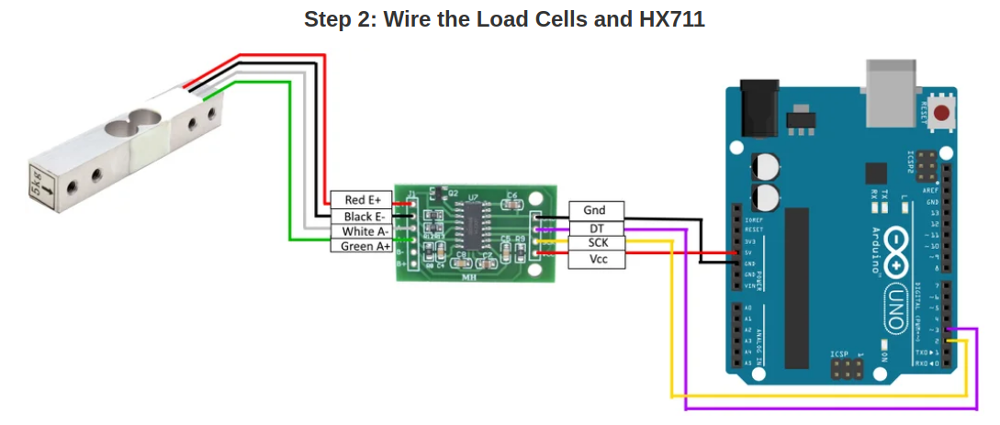

# Urine scale designed by Dr Eichhorn
* This device is used for measuring the volume of liquid. It use a force sensor to measure the grativity and transform the value to volume.
The data is transmitted through wireless Zigbee to the PC.
* The main component of this device are 
1. Battery for power supply
2. Arduino Uno as control unit
3. HX711 weight sensor
4. 5kg load cell
4. Communication Shield with XBee module

## Battery power supply
* The arduino board can use power from either the USB or battery. If we want stable power supply, we can use a long usb cable to connect the board with raspberrypi. So we don't need the battery box.

## Arduino and HX711 weight sensor and load cell
* HX711 on breakout board - This microchip is specially made for amplifying the signals from load cells and reporting them to another mircocontroller. The load cells plug into this board, and this board tells the Arduino what the load cells measure.
* 5kg load cell - Load cells are specially shaped metal parts that have strain gauges glue to them. The strain gauges are resistors that change their resitance when they are bent. When the metal part bends, the resistance of the load cell changes (the HX711 measures this small change in resistance accurately).
* The following picture shows the connection between Arduino, sensor and load cell.

 
 
 

## Communication Shield with XBee module
* The Xbee shield allows an Arduino board to communicate wirelessly using Zigbee.

## Code 
* The code using this sensor can be found in the *arduino_code* folder. There you will find code_for_calibration and code_for_measurement. They all use "HX711" library from https://github.com/bogde/HX711.

* See this link on the Arduino website for instructions on how to add the library to your Arduino IDE: https://www.arduino.cc/en/Guide/Libraries