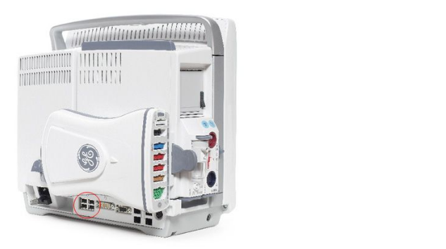
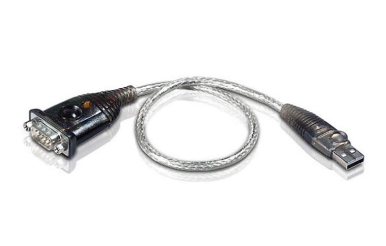
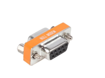
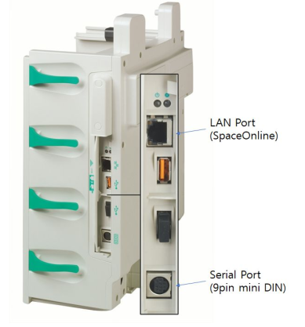
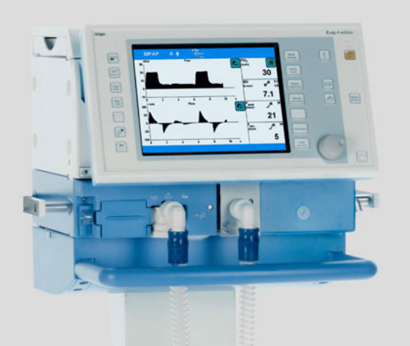

    ICU_devices:
        GE_Monitor x 1
        BBraun Perfusor x 1
        BBraun SpaceCom x 1
        Evita4 ventilator x 1

    Other_devices:
        Intel Realsense Camera x 2
        raspberry pi 4 x 2

    Connection:
        Ethernet cable 15m x 2
        Intel Realsense Camera USB 3.0 cable x 2
        ATEN UC-232A USB serial converter x 2
        serial to usb x 1
        serial to serial x 1
        self-made serial to serial x 1
        serial null modem x 2
        serial gender change x 1

    

## GE_Monitor B650: 
    The connection : GE_Monitor -> ATEN UC-232A USB serial converter -> NUll-Modem -> Gender Changer -> Serial to USB -> Raspberry pi 4
 
 

<em>GE monitor B650, connects any of the 4 USB ports for serial communication</em>

ATEN UC-232A USB serial converter must be used to connect to the CARESCAPE monitor series (you
must use ATEN products only because other USB to serial converters are not recognized by the
monitors). Plug this converter into the USB port on the back of the instrument .You can plug it into
any of the four USB ports on the back of the monitor.

 

<em>ATEN UC-232A USB serial converter</em>

To connect to raspberry pi's serial port, we still need a null modem
(crossed) connector to change the gender from Cross to Direct. In our case, we still need a gender type changer to change the Female/Male of port, before connect it to a serial-to-usb converter.

\
<em>null modem connector</em>

## BBraun Perfusor
    The connection is BBraun Spacecom -> self-made serial cable  -> ATEN UC-232A USB serial converter -> Raspberry pi

 

<em>BBraun SpaceCom, here we use its serial port for communication</em>

A apecial cable is required.Parts can be purchased and manufactured. Make a cable that connects No. 2, No. 3, and No. 5 of 9-pin mini DIN terminal to No. 3, No. 2, and
No. 5 of Female 9-pin DSUB terminal. (This is done by Dr. Eichhorn)

## Evita4 ventilator
    The connection is Evita4 ventilator -> serial to serial -> null-modem -> ATEN UC-232A USB serial converter -> Raspberry pi

 

<em>Evita4 ventilator, the serial port is found in the backside of the machine</em>
